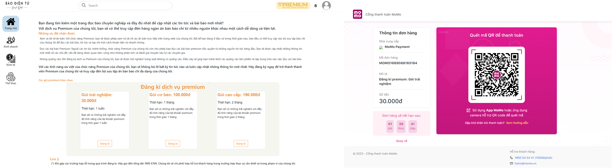
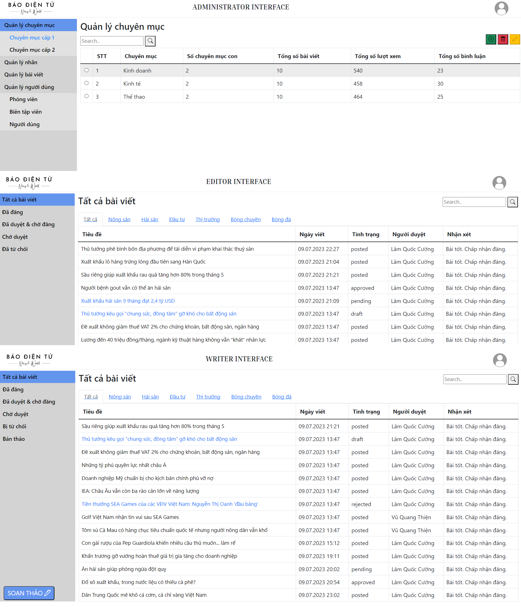
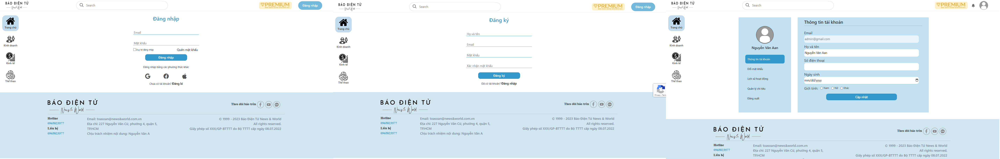

# Phát triển ứng dụng Web-News

**Chủ đề**

-   Tin tức, website, ứng dụng có sử dụng phí, ...

**Các tính năng nổi bật**

-   Forgot-password

-   MOMO

-   Authentication

-   Tìm kiếm bài viết theo keyword

-   Xuất pdf với người dùng đăng kí gói PREMIUM

**Công nghệ sử dụng**

-   Nodejs

-   Bootstrap

-   HTML, CSS

-   PostgreSQL

-   JWT

-   Redis

-   Full-text Search

**Giới thiệu từng phần của website**

-   Đọc tương tác với bài viết (bình luận, tạo PDF, ...)

-   Quản trị người dùng (writer, editor, premium, default)

-   Quản trị bài viết (bản thảo, chờ duyệt, xuất bản)

-   Truy vấn bài viết (tìm kiếm theo text, theo chuyên mục, theo tag, ...)

**Cách cài đặt**

-   Cài đặt nodejs

```bash
npm install
```

-   Cập nhật các giá trị trong file môi trường `.env`

-   Chạy trường trình, tạo database PosgreSQL

```bash
http://localhost:5000/createTables
```

-   Tạo dữ liệu trong database

```bash
sequelize db:seed:all
```

-   Link giao diện người dùng

```bash
http://localhost:5000
```

-   Link giao diện admin

```bash
http://localhost:5000/admin
```

**Hình ảnh demo giao diện website**







**Demo chức năng website**
